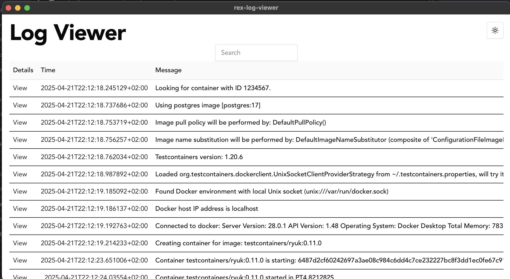
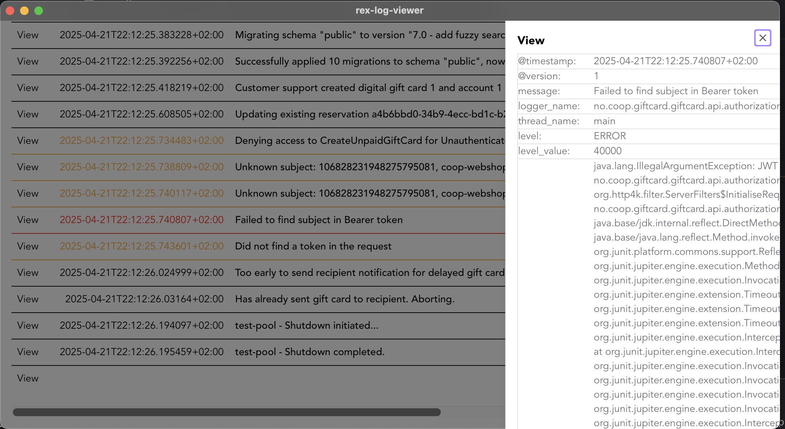

# Rex Log Viewer
> [!WARNING]
> This is just a proof of concept.





## Logback configuration

```xml
<configuration>

    <appender name="SOCKET" class="net.logstash.logback.appender.LogstashTcpSocketAppender">
      <destination>127.0.0.1:54560</destination>
      <reconnectionDelay>1 second</reconnectionDelay>
      <includeCallerData>${includeCallerData}</includeCallerData>
      <connectionTimeout>5 seconds</connectionTimeout>
      <writeBufferSize>8192</writeBufferSize>

      <encoder class="net.logstash.logback.encoder.LogstashEncoder">
        <customFields>{"service":"${service.name}","version":"${service.version}"}</customFields>
        </encoder>
  </appender>

  <root level="DEBUG">
    <appender-ref ref="SOCKET"/>
  </root>
</configuration>
```

## Contributing

This uses the following tools
* mise
* rust / cargo
* pnpm

And this stack
* Tauri
* Vite
* React 19
* Tailwind 4

## Recommended IDE Setup

- [VS Code](https://code.visualstudio.com/) + [Tauri](https://marketplace.visualstudio.com/items?itemName=tauri-apps.tauri-vscode) + [rust-analyzer](https://marketplace.visualstudio.com/items?itemName=rust-lang.rust-analyzer)

## Assets

```tsx
import reactLogo from "./assets/react.svg";

;
```

```tsx

```
